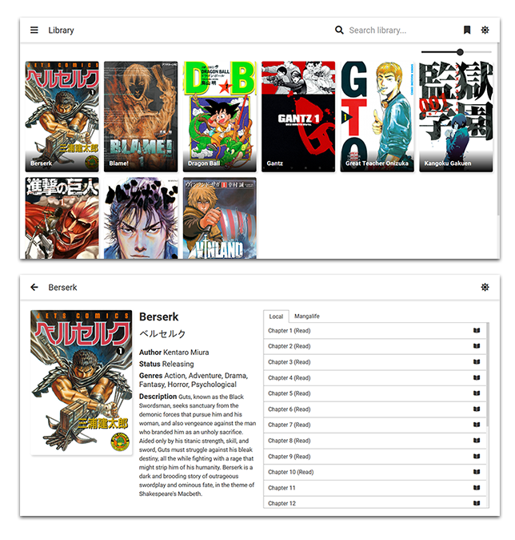

<h1 align="center">

 
Hondana
</h1>

<h1 align="center">

</h1>

Manga reader that runs in the browser, inspired by [Tachiyomi](https://github.com/inorichi/tachiyomi).

### Usage

* Install dependencies
`$ pip install -r requirements.txt`

* Run it
`$ python main.py`

* Open `http://localhost:1080` in your browser.

### Supported sources

* Mangalife
